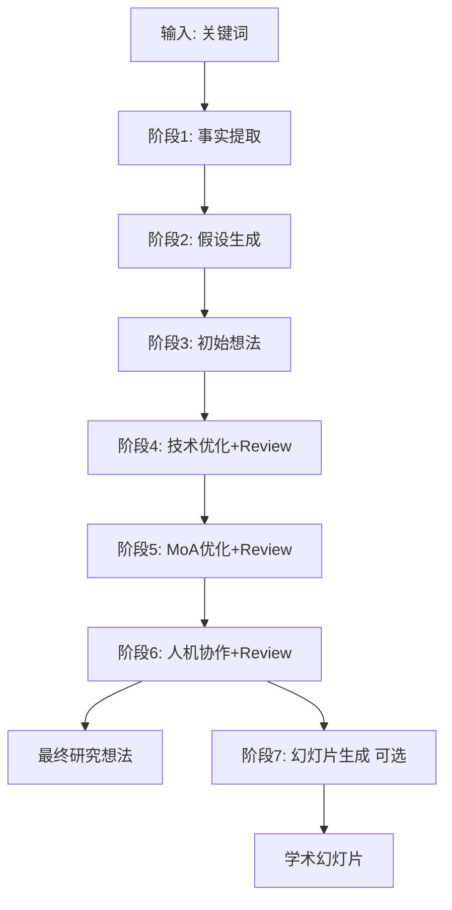

# Scispark 研究想法生成工作流插件 v0.1.0

## 定位

这是一个**结构化研究想法生成系统**，基于 Tashan Scispark 方法论，通过7阶段流程将关键词转化为高质量、可验证的研究想法。

## 核心特性

### 7阶段结构化流程



### Review 评审机制

阶段4-6集成评审循环：
1. **评审当前版本** - 识别优缺点
2. **提取优化方向** - 生成改进建议
3. **搜索补充文献** - 支持优化决策
4. **迭代优化** - 基于评审结果改进

### 专家系统整合

| 时机 | 专家类型 | 输出 |
|------|---------|------|
| 阶段1前 | 领域专家 | 领域概述、理论基础 |
| 阶段4前 | 方法论专家 | 技术方法评估 |
| 阶段5前 | 机制专家 | MoA深度评估 |
| 阶段6前 | 综合专家 | 整体可行性评估 |

## 安装前准备

### 必需的 MCP 服务器

```bash
# 学术文献检索
claude mcp add article-mcp uvx article-mcp server

# 结构化思考
claude mcp add sequentialthinking npx -y @modelcontextprotocol/server-sequential-thinking@latest
```

### 可选环境变量

```bash
export COURSE_ROOT=/path/to/course/directory  # 本地文献库根目录
export EASYSCHOLAR_SECRET_KEY=your_key        # 期刊质量评估（可选）
```

## 使用方法

### 基础用法

```
/scispark "杂交物种形成"
/scispark "CRISPR基因编辑"
/scispark "climate adaptation" "hybrid zones"
```

### 高级选项

```
/scispark "关键词" --skip-slides       # 跳过幻灯片生成
/scispark "关键词" --min-papers 20     # 设置最低文献阈值
/scispark "关键词" --quick-mode        # 快速模式（简化分析）
```

## 输出文件结构

```
03-AI笔记/scispark/{keyword}/
├── experts/                        # 专家系统输出
│   ├── 01_domain_overview.md
│   ├── 04_methodology_expert.md
│   ├── 05_mechanism_expert.md
│   └── 06_integrated_expert.md
├── literature.csv                  # 文献追踪列表
├── 01_fact_extraction.md
├── 02_hypothesis.md
├── 03_initial_idea.md
├── 04_technical_optimization.md
├── 05_moa_optimization.md
├── 06_human_ai_collaboration.md
├── {keyword}_final_idea.md        # 最终研究想法
└── slides/                        # 可选：学术幻灯片
    ├── index.qmd
    ├── _quarto.yml
    ├── references.bib
    └── _output/
```

## 文献阈值规范

采用分级阈值体系：

| 阈值级别 | 全文数量 | 执行模式 | 适用场景 |
|---------|---------|---------|---------|
| 理想阈值 | ≥50篇 | 深度分析 | 成熟领域 |
| 标准阈值 | ≥30篇 | 标准分析 | 大多数领域 |
| 最低阈值 | ≥15篇 | 降级分析+局限说明 | 小众领域 |
| 无法执行 | <15篇 | 错误终止 | 建议调整关键词 |

## 技能模块

| 技能 | 阶段 | 功能 |
|------|------|------|
| fact-extraction | 1 | 从30篇+全文提取结构化事实 |
| hypothesis-generation | 2 | 生成3-5个可验证假设 |
| initial-idea | 3 | 整合假设生成初始研究想法 |
| technical-optimization | 4 | 技术层面方法优化 |
| moa-optimization | 5 | 作用机制深度优化 |
| human-collaboration | 6 | 人机协作最终整合 |
| slide-generation | 7 | 生成 Quarto 幻灯片（可选）|

## 学术规范

### 引用格式
- 文中引用使用 `[序号]` 格式
- 参考文献遵循 Nature 期刊标准
- 包含 PMID、DOI、PMCID（如有）

### 语言规范
| 禁用 | 推荐 |
|---------|---------|
| "首次"、"突破" | "本研究" |
| "我们将" | "本研究" |
| emoji | 不使用 |
| "→" 箭头 | "导致"、"介导" |

## 工具依赖

| 工具 | 说明 |
|------|------|
| Article MCP | 文献搜索 |
| `.tashan/index.json` | 本地文献库优先 |
| pdfget | 文献下载 |
| literature-watcher | 自动监控转换 |
| literature-summarizer | 生成结构化总结 |

## 质量保证

### 拒绝条件
- 文献数量不足15篇
- 数据质量过低
- 关键词无效

### 检查点
- 阶段1：文献数量和质量验证
- 阶段4：技术可行性检查
- 阶段5：机制深度评估
- 阶段6：学术规范检查

## 版本信息

- **版本**: 0.1.0
- **Claude Code要求**: ≥2.0.0
- **许可证**: MIT License

---

*将研究关键词转化为高质量、可验证的研究想法*
