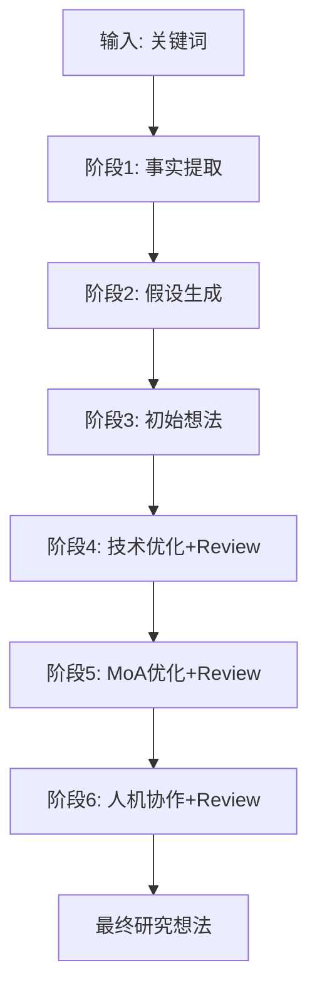

# Agents 使用教程

Agents（智能体）是 Claude Code 中专门化的 AI 助手，每个 Agent 具有特定的角色、专长和行为模式。与 Skills 不同，Agents 在独立的上下文中运行，可以自主决策和执行复杂任务。

## 一、什么是 Agents

### Agents 的核心特点

| 特点 | 说明 |
|------|------|
| **专门化角色** | 每个 Agent 有明确的职责领域和专家身份 |
| **独立上下文** | 在独立的子对话中运行，不干扰主对话 |
| **自动触发** | 通过 description 中的 `<example>` 块定义触发场景 |
| **自主决策** | 基于系统提示自主判断和执行任务 |

### Agents 与其他扩展方式的对比

| 类型 | 本质 | 触发方式 | 上下文 | 适用场景 |
|------|------|----------|--------|----------|
| **Agents** | 独立 AI 助手 | 自动触发 | 独立上下文 | 专门化任务、复杂决策 |
| **Skills** | 工作流程指导 | 自动 + 手动 | 共享主对话 | 标准化流程、团队规范 |
| **MCP Servers** | 外部工具连接 | 按需调用 | 工具返回结果 | 外部数据、API 集成 |
| **CLAUDE.md** | 项目级指导 | 每次对话加载 | 全局上下文 | 项目范围指导原则 |

### 官方插件中的 Agent 示例

Claude Code 官方仓库提供了多个插件，每个插件包含专门的 Agents：

| 插件 | Agents | 用途 |
|------|--------|------|
| **feature-dev** | code-architect, code-explorer, code-reviewer | 功能开发：架构设计、代码探索、代码审查 |
| **plugin-dev** | agent-creator, plugin-validator, skill-reviewer | 插件开发：创建 Agent、验证插件、审查 Skills |
| **pr-review-toolkit** | code-reviewer, code-simplifier, comment-analyzer 等 | PR 审查：代码质量、简化建议、注释分析 |
| **hookify** | conversation-analyzer | 对话分析：自动生成 Hooks |

## 二、Agent 标准格式

### 文件结构

每个 Agent 是一个独立的 Markdown 文件，位于 `agents/` 目录：

```
plugins/my-plugin/
└── agents/
    ├── agent-1.md
    └── agent-2.md
```

### YAML Frontmatter

Agent 文件以 YAML 前置数据开头，定义配置：

```yaml
---
name: agent-identifier          # Agent 标识符（必需）
description: 触发条件描述       # 包含 <example> 块（必需）
model: inherit                  # 使用的模型（可选）
color: green                    # UI 显示颜色（可选）
tools:                          # 允许的工具（可选）
  - Read
  - Grep
  - Bash
---
```

### 关键字段说明

#### name（必需）

Agent 的唯一标识符：

| 规则 | 说明 | 示例 |
|------|------|------|
| 小写字母 | 只能使用小写 | `code-reviewer` |
| 连字符分隔 | 多个单词用 `-` 连接 | `agent-creator` |
| 长度限制 | 3-50 个字符 | `architecture-analyst` |
| 避免保留字 | 不使用 `helper`, `assistant` 等 | ❌ `my-helper` |

#### description（必需）

描述 Agent 的用途和触发条件，**必须包含 `<example>` 块**：

```markdown
description: 当用户请求"创建 agent"、"生成 agent"、"构建新 agent"
或描述 agent 功能时使用。示例：

<example>
Context: 用户想要创建代码审查 agent
user: "创建一个代码质量审查 agent"
assistant: "我将使用 agent-creator agent 生成 agent 配置。"
<commentary>
用户请求创建 agent，触发 agent-creator。
</commentary>
</example>

<example>
Context: 用户描述所需功能
user: "我需要一个生成单元测试的 agent"
assistant: "我将使用 agent-creator agent 创建测试生成 agent。"
<commentary>
用户描述 agent 需求，触发 agent-creator。
</commentary>
</example>
```

**example 块结构**：

```markdown
<example>
Context: [场景描述]
user: "[用户消息]"
assistant: "[触发前的响应]"
<commentary>
[为什么触发此 Agent]
</commentary>
assistant: "I'll use the [agent-name] agent to [做什么]."
</example>
```

#### model（可选）

指定 Agent 使用的模型：

| 值 | 说明 | 适用场景 |
|------|------|----------|
| `inherit`（默认） | 继承当前会话的模型 | 大多数场景 |
| `haiku` | 快速模型 | 简单任务、快速响应 |
| `sonnet` | 平衡模型 | 复杂任务、深度分析 |
| `opus` | 最强模型 | 高质量要求、复杂推理 |

#### color（可选）

Agent 在 UI 中显示的颜色：

| 颜色 | 用途 | 示例 |
|------|------|------|
| `blue` / `cyan` | 分析、审查 | code-reviewer |
| `green` | 生成、创建 | agent-creator |
| `yellow` | 验证、警告 | plugin-validator |
| `red` | 安全、关键 | security-auditor |
| `magenta` | 转换、创意 | code-transformer |

#### tools（可选）

限制 Agent 可以使用的工具：

```yaml
# 只允许特定工具
tools:
  - Read
  - Grep
  - Bash

# 不指定则允许所有工具（默认）
```

### 系统提示

YAML frontmatter 之后是 Agent 的系统提示，定义其行为：

```markdown
---
name: code-architect
description: Designs feature architectures...
---

You are a senior software architect who delivers comprehensive,
actionable architecture blueprints...

## Core Process

**1. Codebase Pattern Analysis**
Extract existing patterns...

**2. Architecture Design**
Based on patterns found...

## Output Guidance

Deliver a decisive, complete architecture blueprint...
```

## 三、Agent 存放位置

### 作用域与路径

| 作用域 | 路径 | 可用范围 | 适用场景 |
|------|------|----------|----------|
| **插件** | `plugins/*/agents/` | 安装该插件的所有用户 | 分发可复用的 Agents |
| **项目** | `.claude/agents/` | 当前项目 | 项目特定的 Agents |
| **个人** | `~/.claude/agents/` | 所有项目 | 个人专用 Agents |

### 优先级规则

如果多个位置有同名 Agent，按以下优先级：

**项目 > 个人 > 插件**

### 插件 Agents（推荐用于分发）

```
plugins/my-plugin/
├── plugin.json
├── agents/
│   ├── agent-1.md
│   └── agent-2.md
└── commands/
    └── command.md
```

插件中的 Agents 会随着插件安装自动可用，适合团队共享和公开发布。

### 项目 Agents

```
my-project/
├── .claude/
│   └── agents/
│       └── project-reviewer.md
└── src/
```

项目级 Agents 适合特定项目的需求，不会被其他项目访问。

### 个人 Agents

```
~/.claude/
└── agents/
    ├── my-coding-style.md
    └── personal-reviewer.md
```

个人级 Agents 在所有项目中可用，适合个人工作流定制。

## 四、创建自定义 Agent

### 完整创建流程

#### 步骤 1：确定 Agent 用途

明确回答以下问题：

1. **Agent 要解决什么问题？**
2. **用户会如何触发它？**（具体的关键词和场景）
3. **Agent 需要什么工具？**
4. **输出格式应该是什么？**

#### 步骤 2：设计标识符

| 原则 | 示例 |
|------|------|
| 描述性 | `code-reviewer` 而非 `helper` |
| 简洁 | `test-generator` 而非 `automatic-test-generation-assistant` |
| 小写+连字符 | `api-designer` 而非 `API_Designer` |

#### 步骤 3：编写 description 和 example 块

```markdown
description: 当用户需要设计 RESTful API、规划 API 端点或构建 API 契约时使用。
触发关键词："API 设计"、"端点结构"、"API 架构"。示例：

<example>
Context: 用户正在开发需要 API 的新功能
user: "我需要为用户管理设计一个 API"
assistant: "我将使用 api-designer agent 创建完整的 API 设计。"
<commentary>
用户明确请求 API 设计，触发 api-designer。
</commentary>
</example>

<example>
Context: 用户询问后端端点结构
user: "应该如何为这个功能设计端点结构？"
assistant: "让我使用 api-designer agent 帮你规划端点结构。"
<commentary>
用户询问端点结构，触发 api-designer。
</commentary>
</example>
```

#### 步骤 4：编写系统提示

参考官方 code-architect 的结构：

```markdown
---
name: api-designer
description: Use this agent when...
---

You are a senior API architect specializing in RESTful API design...

## Core Process

**1. Requirement Analysis**
Understand the domain entities and use cases...

**2. Resource Design**
Identify resources and their relationships...

**3. Endpoint Planning**
Design endpoints following REST principles...

## Output Guidance

Provide a complete API specification including:
- Resource models with fields and types
- Endpoint list with methods and paths
- Request/response schemas
- Authentication requirements
- Error handling strategy
```

#### 步骤 5：选择配置

```yaml
---
name: api-designer
description: Use this agent when...
model: inherit          # 或 sonnet/haiku/opus
color: blue            # 根据用途选择
tools:                 # 可选，限制工具
  - Read
  - Grep
---
```

#### 步骤 6：保存到正确位置

```bash
# 插件 Agent
mkdir -p plugins/my-plugin/agents
nano plugins/my-plugin/agents/api-designer.md

# 项目 Agent
mkdir -p .claude/agents
nano .claude/agents/api-designer.md

# 个人 Agent
mkdir -p ~/.claude/agents
nano ~/.claude/agents/api-designer.md
```

### 简化示例：代码风格审查 Agent

```markdown
---
name: style-checker
description: 当用户请求"检查代码风格"、"审查格式"或"确保代码遵循规范"时使用。
审查代码一致性时自动触发。

<example>
Context: 用户想要检查代码风格
user: "检查这段代码是否符合我们的风格指南"
assistant: "我将使用 style-checker agent 审查代码风格合规性。"
<commentary>
用户明确请求风格检查，触发 style-checker。
</commentary>
</example>
model: inherit
color: yellow
---

You are a code style reviewer ensuring code follows consistent formatting
and naming conventions.

## Review Checklist

- [ ] 缩进一致性（空格/制表符）
- [ ] 命名规范（变量、函数、类）
- [ ] 行长度限制
- [ ] 导入语句排序
- [ ] 注释密度和质量

## Output Format

Report style issues as:
- **严重程度**：（critical/warning/info）
- **位置**：file:line
- **问题**：description
- **建议**：how to fix
```

### 项目实战示例：优化的 Agents

以下两个 agents 已优化并添加到项目的 `.claude/agents/` 目录中：

#### git-expert：Git 版本控制专家

**用途**：Git 操作、版本控制工作流、提交信息格式化、GitHub CLI 使用

**触发关键词**：`git`、`commit`、`分支`、`合并`、`PR`、`pull request`、`gh 命令`

**特点**：
- 完整的 Conventional Commits 类型表格
- GitHub CLI (gh) 命令参考
- 危险操作警告机制
- 问题诊断与解决流程表

**文件位置**：`.claude/agents/git-expert.md`

#### mermaid：图表设计专家

**用途**：创建 Mermaid 流程图、架构图、时序图、甘特图等

**触发关键词**：`mermaid`、`流程图`、`架构图`、`时序图`、`图表`、`diagram`

**特点**：
- 8 种图表类型对照表
- 5 步设计流程（需求→类型→结构→样式→代码）
- 3 个实用模板（完整/简化/时序图）
- 颜色语义和命名规范

**文件位置**：`.claude/agents/mermaid.md`

这两个 agents 展示了以下最佳实践：

1. **规范的 example 块**：3 个不同场景的触发示例
2. **结构化系统提示**：使用 ## 标题分层组织内容
3. **表格辅助说明**：用表格总结关键信息
4. **模板输出**：提供可直接使用的代码模板
5. **清晰的触发关键词**：帮助 Claude 正确识别调用时机

## 五、Agent 最佳实践

### 官方 code-architect 解读

让我们分析官方 code-architect 的设计：

**优秀的设计特点**：

1. **清晰的定位**："senior software architect"
2. **结构化流程**：分为 3 个明确的阶段
3. **具体的输出指导**：详细列出每个输出组件
4. **决策导向**："Make confident architectural choices rather than presenting multiple options"

**可借鉴的模式**：

```markdown
## Core Process

**1. [阶段名称]**
[具体步骤描述]

**2. [阶段名称]**
[具体步骤描述]

## Output Guidance

Deliver [输出类型] that include:
- **组件 1**: [详细说明]
- **组件 2**: [详细说明]
```

### 官方 agent-creator 的触发器设计

agent-creator 的 description 展示了优秀的触发器设计：

**多场景覆盖**：
- "create an agent"
- "generate an agent"
- "build a new agent"
- "describes agent functionality"

**示例多样性**：
- 明确请求
- 描述需求
- 插件开发场景

### 命名最佳实践

| 好的命名 | 原因 |
|----------|------|
| `code-reviewer` | 清晰的职责描述 |
| `api-designer` | 明确的领域 |
| `test-generator` | 动词+结果 |

| 避免 | 原因 |
|------|------|
| `helper` | 太模糊 |
| `assistant` | 保留字 |
| `code-tool` | 不够具体 |

### 描述编写技巧

1. **以 "Use this agent when..." 开头**
2. **列出触发关键词**
3. **提供 2-4 个 example 块**
4. **覆盖不同表达方式**

### 工具限制原则

遵循**最小权限原则**：

```yaml
# 只给必要的工具
tools:
  - Read      # 只读，不修改
  - Grep      # 搜索

# 避免
tools:
  - Write     # 如果不需要写文件
  - Edit      # 如果不需要编辑
```

### 系统提示编写原则

| 原则 | 说明 |
|------|------|
| **明确角色** | "You are a [expert role]" |
| **结构化流程** | 使用编号列表和标题 |
| **具体输出** | 明确说明输出格式和内容 |
| **边界处理** | 说明如何处理边缘情况 |
| **长度适中** | 500-3000 字，太短不够指导，太长难以遵循 |

## 六、项目实战

### cc_plugins 的 scispark-orchestrator

他山团队的 Scispark 插件包含一个复杂的编排智能体，用于研究想法生成工作流。

**Agent 概览**：

```yaml
---
name: scispark-orchestrator
description: Scispark研究想法生成工作流编排智能体。通过7阶段结构化流程，
将研究关键词转化为高质量、可验证的研究想法。
version: 1.0.0
input_schema:
  type: object
  properties:
    keyword:
      type: string
    options:
      type: object
---
```

**核心设计特点**：

1. **状态管理**：通过 `scispark-state.json` 跟踪执行进度
2. **阶段隔离**：7 个独立阶段，每个阶段有明确的输入输出
3. **文献追踪**：使用 `literature.csv` 累积记录所有文献
4. **Review 循环**：阶段 4-6 集成评审机制
5. **专家系统**：4 次专家调用支持各阶段

**工作流架构**：



**关键实现**：

```markdown
## 编排流程

### 步骤 1: 初始化
1. 创建工作目录
2. 初始化状态文件
3. 创建文献追踪 CSV

### 步骤 2: 顺序执行阶段（1-3）
**阶段1: 事实提取** (Temperature: 0.3)
- 评估本地文献库
- 使用 article-mcp 搜索补充文献
- 输出: 01_fact_extraction.md

### 步骤 3: 并行执行阶段（4-6）
**阶段4: 技术优化** (Temperature: 0.8)
- Review 评审当前想法
- 为每个假设(H1-H5)并行优化
- 输出: 04_technical_optimization.md
```

**从实战中学到的经验**：

| 经验 | 应用 |
|------|------|
| **状态文件管理** | 使用 JSON 跟踪复杂流程的进度 |
| **分阶段执行** | 将复杂任务分解为独立阶段 |
| **并行处理** | 对独立任务使用并行执行提高效率 |
| **Review 机制** | 在关键阶段加入质量检查 |

### 创建你的第一个 Agent

**场景**：项目需要一个文档生成 Agent

**步骤 1**：确定需求

```text
用途：从代码生成 Markdown 文档
触发：用户说"生成文档"、"写 readme"、"创建 API 文档"
工具：Read（读取代码）、Write（写文档）
```

**步骤 2**：创建文件

```bash
mkdir -p .claude/agents
nano .claude/agents/doc-generator.md
```

**步骤 3**：编写内容

```markdown
---
name: doc-generator
description: 当用户请求"生成文档"、"创建 README"、"编写 API 文档"或想要文档化代码时使用。
文档化函数、类或模块时自动触发。

<example>
Context: 用户想要文档化代码
user: "为这个模块生成文档"
assistant: "我将使用 doc-generator agent 创建全面的文档。"
<commentary>
用户明确请求文档生成，触发 doc-generator。
</commentary>
</example>
model: inherit
color: green
tools:
  - Read
  - Write
  - Grep
---

You are a technical documentation specialist who creates clear,
comprehensive documentation from code.

## Core Process

**1. Code Analysis**
- 识别主要组件及其用途
- 提取关键函数和类
- 理解依赖关系和关联

**2. Documentation Structure**
- 标题和简要描述
- 安装/设置说明
- 使用示例
- API 参考（针对库）
- 贡献指南（如适用）

**3. Content Generation**
- 编写清晰、简洁的描述
- 为关键用法添加代码示例
- 包含参数/返回类型文档

## Output Format

生成 README.md 或适当的 markdown 文件，包含：
- 项目标题和标语
- 徽章（状态、版本、许可证）
- 目录
- 安装部分（含代码块）
- 快速开始示例
- 详细 API 文档（如果是库）
- 贡献部分
- 许可证信息

使用正确的 markdown 格式：
- ## 用于标题
- ``` 用于代码块
- > 用于备注/警告
- - 用于列表
```

**步骤 4**：测试 Agent

```bash
# 在 Claude Code 中
claude
> "Generate documentation for the src/auth module"
```

## 七、Agent 验证与调试

### 验证检查清单

创建 Agent 后，检查以下项目：

- [ ] **文件命名正确**：小写+连字符，3-50 字符
- [ ] **description 包含 example 块**：至少 2 个示例
- [ ] **example 块格式正确**：包含 Context, user, assistant, commentary
- [ ] **系统提示清晰**：角色、流程、输出明确
- [ ] **工具权限合理**：遵循最小权限原则
- [ ] **模型选择合适**：inherit/sonnet/haiku/opus
- [ ] **颜色匹配用途**：blue/green/yellow/red/magenta

### 测试 Agent

**手动测试**：

```bash
# 1. 启动 Claude Code
claude

# 2. 尝试触发 Agent
> "[使用你在 example 中定义的用户消息]"

# 3. 观察 Agent 是否被调用
# 应该看到类似 "I'll use the [agent-name] agent to..."
```

**验证触发器**：

```bash
# 测试不同的触发方式
> "Create an agent..."        # 应该触发 agent-creator
> "I need an agent that..."   # 应该触发 agent-creator
> "Help me build..."          # 可能触发，取决于 description
```

### 调试技巧

#### Agent 未触发

**原因 1**：description 关键词不够明确

```yaml
# 不好的描述
description: Helps with documentation

# 好的描述
description: Use this agent when the user asks to "generate documentation",
"create README", "write API docs". Triggered by keywords: documentation,
docs, README, API reference.
```

**原因 2**：example 块格式错误

```markdown
<!-- 错误：缺少 commentary -->
<example>
Context: User wants docs
user: "Generate docs"
assistant: "I'll use doc-generator"
</example>

<!-- 正确：包含所有必需元素 -->
<example>
Context: User wants docs
user: "Generate docs"
assistant: "I'll check the doc-generator."
<commentary>
User requests documentation, trigger doc-generator.
</commentary>
assistant: "I'll use the doc-generator agent to create documentation."
</example>
```

**原因 3**：文件路径不正确

```bash
# 检查 Agent 是否在正确位置
ls ~/.claude/agents/           # 个人
ls .claude/agents/              # 项目
ls plugins/*/agents/            # 插件
```

#### Agent 输出不符预期

**检查系统提示**：

- 是否有明确的输出格式指导？
- 流程步骤是否清晰？
- 是否有示例或模板？

**添加调试输出**：

```markdown
## Debug Output

Before generating final output, show:
1. Your understanding of the request
2. The plan you will follow
3. Key decisions you made
```

### 使用官方工具验证

```bash
# 如果有验证脚本
./scripts/validate-agent.sh agents/your-agent.md

# 检查 YAML 语法
python3 -c "import yaml; yaml.safe_load(open('agents/your-agent.md'))"
```

## 八、常见问题

### Q1: Agent 和 Skill 如何选择？

| 场景 | 推荐 |
|------|------|
| 需要独立上下文、自主决策 | Agent |
| 标准化流程、团队规范 | Skill |
| 简单的提示模板 | Skill |
| 复杂的多步骤任务 | Agent |

### Q2: 一个插件可以有多个 Agent 吗？

可以！官方插件通常包含多个 Agents：

```
pr-review-toolkit/
├── agents/
│   ├── code-reviewer.md
│   ├── code-simplifier.md
│   ├── comment-analyzer.md
│   ├── pr-test-analyzer.md
│   ├── silent-failure-hunter.md
│   └── type-design-analyzer.md
```

### Q3: Agent 可以调用其他 Agent 吗？

可以！Agent 可以通过 Task 工具调用其他 Agent（包括插件内的和全局的）。

### Q4: 如何限制 Agent 的资源使用？

1. **限制工具**：只给必要的 tools
2. **选择模型**：使用 haiku 而非 opus
3. **明确边界**：在系统提示中定义明确的职责范围

### Q5: Agent 的性能如何优化？

| 策略 | 说明 |
|------|------|
| 使用 haiku | 简单任务使用快速模型 |
| 限制工具访问 | 减少不必要的工具调用 |
| 明确输出格式 | 避免反复修改 |
| 添加缓存 | 对重复输入使用缓存结果 |

## 九、进阶主题

### Agent 组合模式

**顺序模式**：Agent A → Agent B → Agent C

```
code-architect (设计) → task-executor (实现) → code-reviewer (审查)
```

**并行模式**：Agent A + Agent B

```
frontend-developer (前端) + backend-architect (后端)
```

**验证模式**：Agent A → Agent B (审查)

```
primary-agent (实现) → reviewer-agent (验证)
```

### input_schema 使用

Agent 可以定义输入 schema：

```yaml
---
name: data-analyzer
description: Analyzes datasets...
input_schema:
  type: object
  properties:
    dataset_path:
      type: string
      description: Path to the dataset file
    analysis_type:
      type: string
      enum: [statistical, visual, comparative]
  required: [dataset_path]
---
```

### Hooks 集成

Agent 可以配合 Hooks 使用：

```json
{
  "hooks": {
    "PreToolUse": {
      "script": "scripts/check-agent-permission.py"
    }
  }
}
```

## 参考链接

### 官方文档

| 名称 | 链接 |
|------|------|
| Claude Code 官方文档 | <https://code.claude.com/docs> |
| Claude Code GitHub | <https://github.com/anthropics/claude-code> |
| 官方插件仓库 | <https://github.com/anthropics/claude-code/tree/main/plugins> |

### 官方 Agent 示例

| Agent | 插件 | 文件 |
|-------|------|------|
| code-architect | feature-dev | [agents/code-architect.md](https://github.com/anthropics/claude-code/blob/main/plugins/feature-dev/agents/code-architect.md) |
| code-explorer | feature-dev | [agents/code-explorer.md](https://github.com/anthropics/claude-code/blob/main/plugins/feature-dev/agents/code-explorer.md) |
| agent-creator | plugin-dev | [agents/agent-creator.md](https://github.com/anthropics/claude-code/blob/main/plugins/plugin-dev/agents/agent-creator.md) |
| plugin-validator | plugin-dev | [agents/plugin-validator.md](https://github.com/anthropics/claude-code/blob/main/plugins/plugin-dev/agents/plugin-validator.md) |

### 社区资源

| 名称 | 链接 |
|------|------|
| awesome-claude-agents | <https://github.com/your-repo> |
| Agent 设计模式讨论 | <https://discuss.anthropic.com> |
