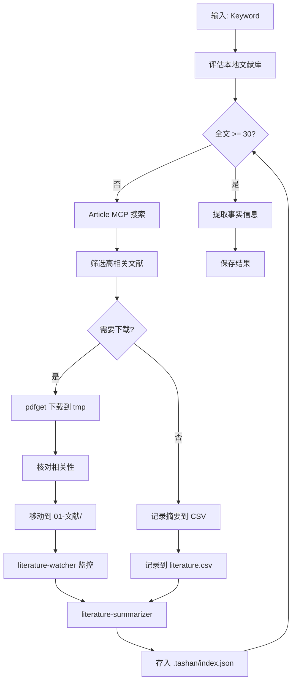

# 事实信息提取技能

## 技能描述

从学术论文中提取结构化的事实信息，为后续研究想法生成提供数据基础。

## 输入参数

```yaml
keyword:
  type: string
  required: true
  description: 研究关键词

min_papers:
  type: integer
  default: 30
  description: 最低文献数量阈值

literature_path:
  type: string
  default: ".tashan/index.json"
  description: 本地文献库路径
```

## 执行流程



## 核心功能

### 1. 文献库评估

区分全文文献和摘要文献：

| 类型 | 条件 | 阈值 | 用途 |
|------|------|------|------|
| 全文文献 | PDF 已下载 | ≥ 30 篇 | 深度分析 |
| 摘要文献 | 仅有摘要 | ≤ 200 篇 | 扩展视野 |

### 2. 分级阈值决策

| 阈值级别 | 全文数量 | 执行模式 |
|---------|---------|---------|
| 理想阈值 | ≥50篇 | 深度分析 |
| 标准阈值 | ≥30篇 | 标准分析 |
| 最低阈值 | ≥15篇 | 基础分析+局限说明 |
| 无法执行 | <15篇 | 错误终止 |

### 3. 文献扩充循环

```bash
# 自动循环直到达到阈值
while [ $(ls 01-文献/*.pdf | wc -l) -lt 30 ]; do
    pdfget -s "{关键词} AND pubmed pmc[sb]" -l 20 -d -t 5 -o tmp
    mv tmp/*.pdf 01-文献/ 2>/dev/null
done
```

### 4. 事实提取规则

- 只提取明确陈述的事实
- 保持客观性和准确性
- 按重要性排序
- 每个事实标注来源 [序号]

## 工具依赖

| 工具 | 用途 |
|------|------|
| `.tashan/index.json` | 本地文献库 |
| `mcp__article_mcp__search_literature` | 在线搜索 |
| `pdfget` | 批量下载 |
| `literature-watcher` | 自动监控 |
| `literature-summarizer` | 结构化总结 |

## 环境变量

```bash
export COURSE_ROOT=/path/to/course  # 项目根目录
```

## 配置

| 参数 | 值 |
|------|-----|
| Temperature | 0.3 |
| 全文文献阈值 | ≥ 30 篇 |
| 摘要文献上限 | ≤ 200 篇 |
| 时效性优先 | 近5年 |

## 输出文件

```
03-AI笔记/scispark/{keyword}/
├── experts/
│   └── 01_domain_overview.md
├── literature.csv
└── 01_fact_extraction.md
```

## 文献 CSV 首次创建

```csv
id,title,authors,journal,year,doi,pmid,pmcid,stage,usage,abstract
L001,Genomic analysis...,Smith,Nature,2025,10.1038/...,12345678,PMC...,阶段1,阶段1:事实提取-杂交模式,
L002,Mechanisms of...,Wang,Science,2024,10.1126/...,12345679,,专家系统,专家系统:领域概述,
...
```

## 专家系统调用

**存储位置**: `experts/01_domain_overview.md`

**输出内容**:
- 领域概述
- 理论基础
- 研究方法
- 关键发现
- 权威专家与机构

## Prompt 模板

```
请从以下论文中提取事实信息：
1. 只提取明确陈述的事实
2. 保持客观性和准确性
3. 按重要性排序
4. 每个事实标注来源 [序号]

Title: {title}
Abstract: {abstract}

输出格式：
1. [事实1] [序号]
2. [事实2] [序号]
...
```

## 质量检查

- [ ] 全文文献 ≥ 30 篇
- [ ] literature.csv 已创建
- [ ] 专家系统概述已生成
- [ ] 事实信息已提取并标注来源
