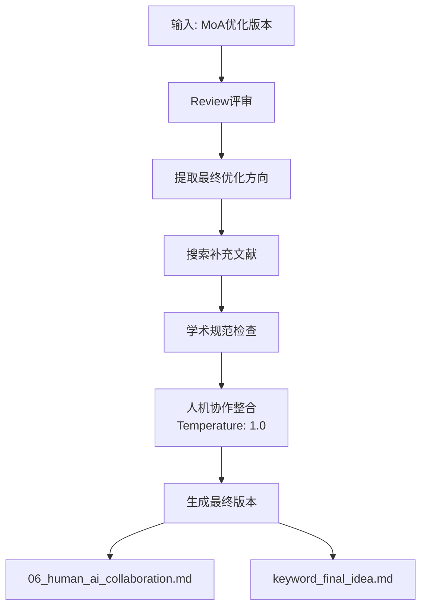

# 人机协作技能

## 技能描述

最终的人机协作阶段，整合所有优化成果，生成最终版本的研究想法。

## 执行流程



## Review 评审机制

```markdown
## Review 评审

### MoA优化版本评估
#### 优点
- [继承阶段5的优点]

#### 缺点（人机协作需解决）
- [列出需最终整合的问题]

### 专家系统视角
#### 综合专家评估
| 方面 | 专家意见 |
|------|---------|
| 整体可行性 | [资源、时间、技术可行性] |
| 研究价值 | [理论创新性、应用前景] |
| 风险评估 | [潜在失败点、缓解建议] |
| 优化建议 | [最终整合建议] |

### 跨阶段改进追踪总结
| 问题ID | 提出阶段 | 问题描述 | 改进阶段 | 最终验证 |
|--------|---------|---------|---------|---------|
| S4-P1 | 阶段4 | [问题] | 阶段4 | ✅ 已解决 |
| S5-P1 | 阶段5 | [问题] | 阶段5 | ✅ 已解决 |
| S6-P1 | 阶段6 | [问题] | 阶段6 | ✅ 本阶段解决 |
```

## 学术规范检查

基于 `.clinerules/academic-style.md` 进行检查：

| 检查项 | 检查标准 | 当前状态 | 改进建议 |
|--------|---------|---------|---------|
| 标题规范 | 学术化、具体、反映核心内容 | [检查] | [建议] |
| 绝对化表述 | 无"首次"、"突破"等 | [检查] | [建议] |
| 符号规范 | 无emoji、非学术符号 | [检查] | [建议] |
| 语言风格 | 客观、谨慎、留有余地 | [检查] | [建议] |
| 引用格式 | 统一为 [序号] | [检查] | [建议] |
| 术语规范 | 物种拉丁名斜体、基因斜体 | [检查] | [建议] |

### 常见学术表述问题

| ❌ 禁用 | ✅ 推荐 |
|---------|---------|
| "首次系统解析" | "本研究系统解析..." |
| "完整框架" | "框架的构建" |
| "我们将..." | "本研究..." |
| "✅" emoji | 不使用 |
| "→" 箭头 | "导致"、"介导" |
| "成功" | "有效"、"可行" |

## 核心功能

### 1. 假设追踪总结

```markdown
## 假设追踪总结

| 假设ID | 假设描述 | 阶段4 | 阶段5 | 阶段6 | 最终状态 |
|--------|---------|------|------|------|---------|
| H1 | [描述] | 技术优化 | MoA深化 | 最终整合 | ✅ 完全整合 |
| H2 | [描述] | 技术优化 | MoA深化 | 最终整合 | ✅ 完全整合 |
```

### 2. 假设与研究设计映射

```markdown
## 假设与研究设计映射
| 假设 | 研究设计组件 | 相关问题 | 验证方法 |
|------|------------|---------|---------|
| H1 | [组件1] | S4-P1, S5-P1, S6-P1 | [方法] |
| H2 | [组件2] | S4-P2, S5-P2 | [方法] |
```

## 配置

| 参数 | 值 |
|------|-----|
| Temperature | 1.0 |
| Review优先级 | 整体完善 |

## 输出文件

```
03-AI笔记/scispark/{keyword}/
├── 06_human_ai_collaboration.md
└── {keyword}_final_idea.md
```

## 文献 CSV 最终更新

```csv
# 新增最终整合文献
L080,Final integration paper,Author Z,Science,2024,...,阶段6,阶段6:综合评估-应用转化,

# 新增专家系统文献
L081,Expert integrated ref,Author W,Nature Review,2023,...,专家系统,专家系统:综合评估,

# 完整追踪示例
L001,Genomic analysis...,Smith,2025,...,专家系统;阶段1;阶段4;阶段5;阶段6,专家系统:概述;阶段1:提取;阶段4:方法;阶段5:机制;阶段6:综合,
```

## 文献统计

```markdown
## 文献统计
| 类型 | 数量 | 说明 |
|------|------|------|
| 全文文献 | XX | 用于深度分析 |
| 摘要文献 | XX | 用于扩展视野 |
| 专家系统文献 | XX | 4次专家系统调用 |
| **总计** | **XX** | 包含所有使用文献 |
```

## 专家系统调用

**存储位置**: `experts/06_integrated_expert.md`

**输出内容**:
- 整体可行性评估
- 研究价值评估
- 风险评估
- 最终整合建议

## Prompt 模板

```
基于 MoA 优化版本进行最终人机协作整合：

当前版本：
{MoA优化内容}

综合专家评估：
{专家评估内容}

要求：
1. 识别需要最终整合的问题
2. 进行学术规范检查
3. 生成问题ID: S6-P1, S6-P2...
4. 整合所有优化成果
5. 生成最终研究想法文档
```

## 最终研究想法结构

```markdown
# [研究标题]

## 摘要
[200-300字]

## 研究背景
[背景介绍，含引用]

## 研究目标
1. [目标1]
2. [目标2]
...

## 研究方法
[方法概述]

## 预期结果
[预期发现]

## 创新点
[创新点]

## 研究意义
[理论意义+应用价值]

## 假设与研究设计映射
[假设-设计对应表]

## 参考文献
[完整文献列表]
```

## 质量检查

- [ ] 学术规范检查通过
- [ ] 跨阶段问题追踪完整
- [ ] 假设-研究映射清晰
- [ ] literature.csv 完整
