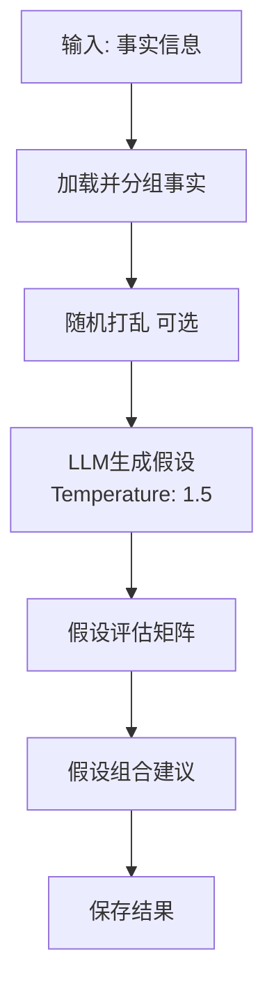

# 假设生成技能

## 技能描述

基于事实信息生成可验证的研究假设。

## 输入参数

```yaml
fact_file:
  type: string
  required: true
  description: 事实提取文件路径

hypothesis_count:
  type: integer
  default: 5
  description: 生成假设数量 (3-5)
```

## 执行流程



## 核心功能

### 1. 假设生成要求

- 可验证和可证伪
- 基于已知事实
- 提出具体机制或关系
- 分配永久假设ID (H1, H2, H3...)

### 2. 假设评估矩阵

| 假设 | 可验证性 | 理论创新性 | 实验可行性 | 预期影响 | 优先级 |
|------|---------|-----------|-----------|---------|-------|
| H1 | 高/中/低 | 高/中/低 | 高/中/低 | 高/中/低 | 高/中/低 |

### 3. 假设组合建议

```markdown
## 下一步假设组合建议

基于优先级评估，建议在阶段3中：
1. **H1 + H2 组合**: [组合理由]
2. **H3 + H4 组合**: [组合理由]
3. **H5 独立开发**: [理由]
```

## 配置

| 参数 | 值 |
|------|-----|
| Temperature | 1.5 |
| 假设数量 | 3-5 |
| 随机打乱 | 可选 |

## 输出文件

```
03-AI笔记/scispark/{keyword}/
└── 02_hypothesis.md
```

## 文献 CSV 更新

**新增文献**:
```csv
L020,New hypothesis paper,Author A,Journal B,2025,...,阶段2,阶段2:假设支持-H1.生殖隔离机制,
```

**已有文献更新**:
```csv
L001,Genomic analysis...,Smith,2025,...,阶段1;阶段2,阶段1:事实提取;阶段2:假设支持-H1,
```

## Prompt 模板

```
基于以下已知信息，为 {关键词} 生成3-5个研究假设：

已知信息：
{事实列表}

假设要求：
1. 可验证和可证伪
2. 基于已知事实
3. 提出具体机制或关系
4. 分配永久假设ID (H1, H2, H3...)

格式：
### H1. [假设标题]
**假设陈述**: [核心假设]
**推理依据**: [支撑事实和逻辑]
**可验证预测**: [具体可检验的预测]
```

## 输出格式要求

```markdown
## 假设列表

### H1. [假设标题]
**假设陈述**: [核心假设]
**推理依据**: [支撑事实和逻辑]
**可验证预测**: [具体可检验的预测]

### H2. [假设标题]
...

## 假设评估矩阵

| 假设 | 可验证性 | 理论创新性 | 实验可行性 | 预期影响 | 优先级 |
|------|---------|-----------|-----------|---------|-------|
| H1 | 高 | 高 | 中 | 高 | 高 |
| ...

## 下一步假设组合建议

...
```

## 质量检查

- [ ] 假设数量 3-5 个
- [ ] 每个假设有明确ID
- [ ] 评估矩阵完整
- [ ] 组合建议合理
