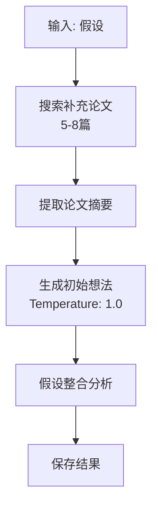

# 初始研究想法技能

## 技能描述

结合假设和文献生成初始研究想法。

## 输入参数

```yaml
hypothesis_file:
  type: string
  required: true
  description: 假设文件路径

additional_papers:
  type: integer
  default: 8
  description: 补充论文数量
```

## 执行流程



## 核心功能

### 1. 假设整合要求

```markdown
## 假设整合

本初始研究想法整合了以下假设：

| 假设ID | 假设描述 | 整合方式 | 贡献 |
|--------|---------|---------|------|
| H1 | [描述] | 核心整合 | 提供理论框架 |
| H2 | [描述] | 辅助整合 | 提供方法支持 |
| H3 | [描述] | 未整合 | 预留后续优化 |

## 假设组合策略

- **主要组合**: H1 + H2 → [整合后的研究方向]
- **次要组合**: H3 + H4 → [辅助研究方向]
- **独立开发**: H5 → [独立模块]
```

### 2. 研究想法结构

- 研究标题
- 摘要 (200-300字)
- 研究目标 (3-5个)
- 方法概述
- 预期结果
- 创新点

## 配置

| 参数 | 值 |
|------|-----|
| Temperature | 1.0 |
| 补充论文数 | 5-8篇 |

## 输出文件

```
03-AI笔记/scispark/{keyword}/
└── 03_initial_idea.md
```

## 文献 CSV 更新

**新增文献**:
```csv
L035,Paper for methodology,Author X,Journal Y,2024,...,阶段3,阶段3:方法支持-具体方法,
```

**已有文献更新**:
```csv
L001,Genomic analysis...,Smith,2025,...,阶段1;阶段2;阶段3,阶段1:事实提取;阶段2:假设支持;阶段3:理论框架,
```

## Prompt 模板

```
基于以下信息生成研究想法：

假设：
{假设列表}

相关文献：
{论文摘要}

生成包含：
1. 研究标题
2. 摘要 (200-300字)
3. 研究目标 (3-5个)
4. 方法概述
5. 预期结果
6. 创新点

假设整合要求：
- 明确说明使用了哪些假设
- 说明假设的组合方式
- 描述各假设的贡献
```

## 输出格式要求

```markdown
# [研究标题]

## 摘要
[200-300字]

## 研究目标
1. [目标1]
2. [目标2]
...

## 方法概述
[方法描述]

## 预期结果
[预期结果]

## 创新点
[创新点]

## 假设整合
| 假设ID | 假设描述 | 整合方式 | 贡献 |
|--------|---------|---------|------|
...
```

## 质量检查

- [ ] 摘要字数 200-300 字
- [ ] 研究目标 3-5 个
- [ ] 假设整合明确
- [ ] 方法概述清晰
