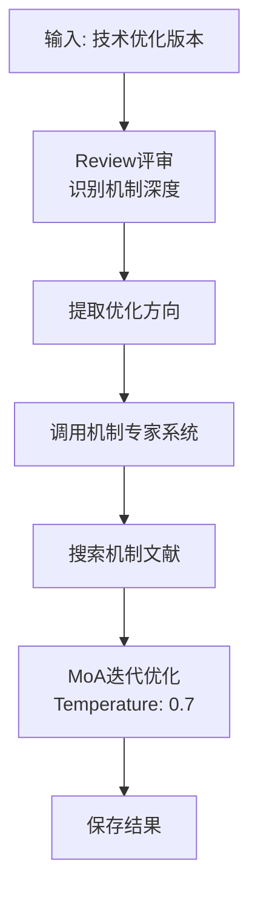

# MoA 优化技能

## 技能描述

基于作用机制(MoA)深度优化研究想法。

## MoA 评估维度

| 维度 | 评估问题 | 通过标准 |
|------|---------|---------|
| 分子触发 | 识别启动分子/事件？ | 明确触发因素 |
| 信号通路 | 构建完整信号路径？ | 每步都有分子基础 |
| 因果关系 | 建立因果链？ | 非仅仅是相关 |
| 时间动态 | 明确时间线？ | 事件顺序清晰 |
| 空间特异性 | 明确定位？ | 组织/细胞/亚细胞 |

## 执行流程



## Review 评审机制

```markdown
## Review 评审

### 技术优化版本评估
#### 优点
- [继承阶段4的优点]

#### 缺点（机制深度不足）
- [列出2-4条]

### 专家系统视角
#### 机制专家评估
| MoA维度 | 专家评估 |
|---------|---------|
| 分子触发 | [启动因素是否明确？] |
| 信号通路 | [通路完整性如何？] |
| 因果关系 | [是否建立因果链？] |
| 时间动态 | [时间线是否清晰？] |
| 空间特异性 | [定位是否明确？] |

### 改进计划
| 问题ID | 问题描述 | MoA改进措施 | 预期效果 |
|--------|---------|------------|---------|
| S5-P1 | [阶段4遗留] | [机制改进] | [效果] |
```

## 核心功能

### 1. 假设追踪

```markdown
## 假设追踪

本阶段从机制层面深化以下假设：

| 假设ID | 假设描述 | MoA深化内容 | 相关问题 | 累积进展 |
|--------|---------|------------|---------|---------|
| H1 | [描述] | [分子机制解析] | S5-P1 | ✅ 技术优化→MoA深化 |
```

### 2. 机制-假设映射

```markdown
## 机制-假设映射
| 核心机制 | 对应假设 | 验证方法 |
|---------|---------|---------|
| [机制1] | H1 | [验证方法] |
| [机制2] | H2 | [验证方法] |
```

## 配置

| 参数 | 值 |
|------|-----|
| Temperature | 0.7 |
| Review优先级 | MoA深度 |

## 输出文件

```
03-AI笔记/scispark/{keyword}/
└── 05_moa_optimization.md
```

## 文献 CSV 更新

```csv
# 新增机制文献
L065,Mechanism paper,Author P,Cell,2024,...,阶段5,阶段5:机制分析-DNA修复通路,

# 新增专家系统文献
L066,Expert mechanism ref,Author Q,Molecular Cell,2023,...,专家系统,专家系统:机制评估,
```

## 专家系统调用

**存储位置**: `experts/05_mechanism_expert.md`

**输出内容**:
- 分子触发机制评估
- 信号通路完整性分析
- 因果关系链评估
- 时间动态分析
- 空间特异性评估

## Prompt 模板

```
基于技术优化版本进行 MoA 深度优化：

当前版本：
{技术优化内容}

机制专家评估：
{专家评估内容}

MoA 评估维度：
1. 分子触发机制
2. 信号通路完整性
3. 因果关系链
4. 时间动态
5. 空间特异性

要求：
1. 识别当前版本的机制深度不足
2. 从5个维度深化机制分析
3. 生成问题ID: S5-P1, S5-P2...
4. 追踪跨阶段的改进状态
```

## 质量检查

- [ ] 5个 MoA 维度已评估
- [ ] 因果链明确（非相关）
- [ ] 时间/空间特异性清晰
- [ ] 机制-假设映射完整
