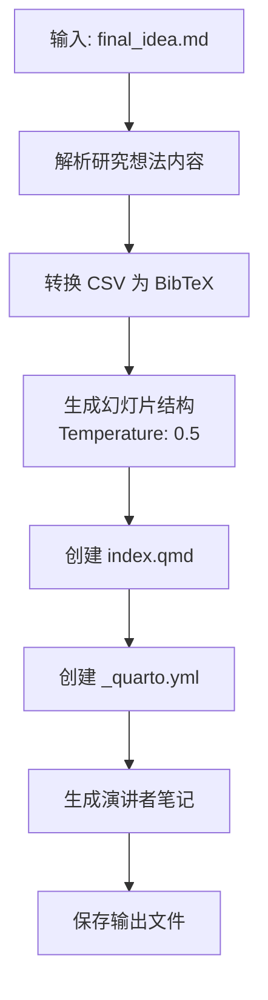
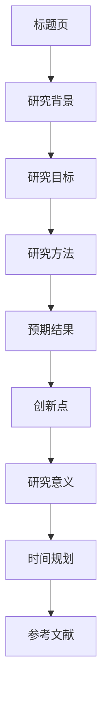

# 幻灯片生成技能

## 技能描述

基于最终研究想法生成学术幻灯片，使用 Quarto + reveal.js 输出专业演示文稿。

## 执行流程



## 幻灯片结构



**标准结构** (15-20张):

| 幻灯片 | 内容 | 建议时间 |
|--------|------|---------|
| 1 | 标题页 | 30s |
| 2-3 | 研究背景 | 2min |
| 4-5 | 研究目标与假设 | 2min |
| 6-10 | 研究方法 | 5min |
| 11-13 | 预期结果 | 3min |
| 14-15 | 创新点与意义 | 2min |
| 16 | 时间规划 | 1min |
| 17 | 参考文献 | 30s |

## 文献转换: CSV → BibTeX

### 转换逻辑

```python
for paper in csv:
    if paper.stage contains "阶段6":
        bib_id = paper.id  # L001, L002...
        bib_entry = f"""
@article{{{bib_id}},
  title = {{{{paper.title}}}},
  author = {{{{paper.authors}}}},
  journal = {{{{paper.journal}}}},
  year = {{{{paper.year}}},
  doi = {{{{paper.doi}}}}
}"""
```

### BibTeX 格式示例

```bibtex
@article{L001,
  title = {Genomic analysis of hybrid speciation},
  author = {Smith, J. and Johnson, A.},
  journal = {Nature Ecology \& Evolution},
  year = {2025},
  volume = {9},
  pages = {123--145},
  doi = {10.1038/s41559-025-00001-x}
}
```

## 配置

| 参数 | 值 |
|------|-----|
| Temperature | 0.5 |
| 幻灯片数量 | 15-20 张 |
| 单页信息量 | ≤5个要点 |
| 总演讲时长 | 15-20 分钟 |

## 输出文件结构

```
03-AI笔记/scispark/{keyword}/slides/
├── index.qmd              # Quarto幻灯片源文件
├── _quarto.yml            # Quarto配置
├── references.bib         # BibTeX参考文献
├── custom.scss            # 自定义样式
├── academic.csl           # 引用格式样式
├── speaker_notes.md       # 演讲者笔记
├── figures/               # 图片资源目录
└── _output/
    ├── slides.html        # reveal.js HTML
    └── slides.pdf         # PDF版本
```

## 可视化建议

### 图表类型推荐

| 内容类型 | 推荐图表 | Mermaid语法 |
|---------|---------|------------|
| 研究流程 | 流程图 | `flowchart LR` |
| 时间规划 | 甘特图 | `gantt` |
| 系统架构 | 结构图 | `graph TD` |
| 序列关系 | 时序图 | `sequenceDiagram` |

## index.qmd 模板

```markdown
---
title: "{研究标题}"
author: "{作者信息}"
date: "{日期}"
format:
  revealjs:
    theme: [default, custom]
    slide-number: true
bibliography: references.bib
csl: academic.csl
---

# {研究标题}

## {副标题}
{作者信息} | {日期}

---

## 研究背景

**背景要点**
- 要点1 [@L001]
- 要点2 [@L002]
- 要点3 [@L003]

---

## 研究目标

本研究旨在：
1. **目标1**: [具体描述] [@L004]
2. **目标2**: [具体描述] [@L005]

**核心假设**: {假设描述}

---

## 参考文献

::: references
:::
```

## 学术规范检查

| 检查项 | 标准 |
|--------|------|
| 标题 | 清晰、具体、学术化 |
| 内容 | 每页≤5个要点 |
| 字体 | 大小≥24pt |
| 引用 | 使用 `@citekey` 格式 |
| 图表 | 清晰标注，有图注 |
| 符号 | 无 emoji |

## 使用指南

### 渲染幻灯片

```bash
cd 03-AI笔记/scispark/{keyword}/slides

# 渲染为 HTML
quarto render

# 渲染为 PDF
quarto render --to pdf

# 实时预览
quarto preview
```

## Prompt 模板

```
基于以下研究想法生成学术幻灯片：

研究想法：
{final_idea_content}

要求：
1. 使用 Quarto + reveal.js 格式
2. 遵循学术幻灯片规范
3. 每页内容简洁，≤5个要点
4. 使用 @citekey 格式引用文献
5. 包含必要的可视化建议

生成以下文件：
1. slides/index.qmd
2. slides/_quarto.yml
3. slides/references.bib
4. slides/speaker_notes.md
```

## 质量检查

- [ ] 幻灯片数量 15-20 张
- [ ] 每页≤5个要点
- [ ] 引用格式 @citekey
- [ ] 无 emoji 和非学术符号
- [ ] 可视化图表合理
