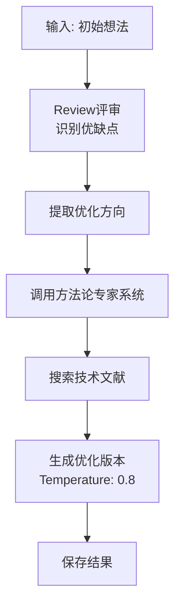

# 技术优化技能

## 技能描述

从技术层面优化研究方法，包含 Review 评审机制。

## 输入参数

```yaml
idea_file:
  type: string
  required: true
  description: 初始想法文件路径

expert_file:
  type: string
  required: true
  description: 方法论专家评估文件
```

## 执行流程



## Review 评审机制

```markdown
## Review 评审

### 当前版本评估
#### 优点
- [列出1-3条]

#### 缺点
- [列出2-4条]

### 专家系统视角
#### 方法论专家评估
| 方面 | 专家意见 |
|------|---------|
| 技术选型 | [方法成熟度、适用性] |
| 可行性 | [资源、技术难度] |
| 替代方案 | [常用方法对比] |
| 潜在风险 | [失败可能原因] |

### 改进计划
| 问题ID | 问题描述 | 改进措施 | 预期效果 |
|--------|---------|---------|---------|
| S4-P1 | [问题] | [改进] | [效果] |
| S4-P2 | [问题] | [改进] | [效果] |
```

## 核心功能

### 1. 假设追踪

```markdown
## 假设追踪

本阶段从技术层面优化以下假设：

| 假设ID | 假设描述 | 技术优化内容 | 相关问题 |
|--------|---------|------------|---------|
| H1 | [来自阶段2] | [方法优化] | S4-P1 |
| H2 | [来自阶段2] | [方法优化] | S4-P2 |
```

### 2. 技术方法-假设映射

```markdown
## 技术方法-假设映射
| 技术方法 | 对应假设 | 预期贡献 |
|---------|---------|---------|
| [方法1] | H1 | 支持H1验证 |
| [方法2] | H2 | 支持H2验证 |
```

## 配置

| 参数 | 值 |
|------|-----|
| Temperature | 0.8 |
| Review优先级 | 技术可行性 |

## 输出文件

```
03-AI笔记/scispark/{keyword}/
└── 04_technical_optimization.md
```

## 文献 CSV 更新

```csv
# 新增技术文献
L050,Methodology paper,Author M,Methods,2024,...,阶段4,阶段4:方法优化-CRISPR,

# 新增专家系统文献
L051,Expert methodology ref,Author N,Nature Protocols,2023,...,专家系统,专家系统:方法论评估,
```

## 专家系统调用

**存储位置**: `experts/04_methodology_expert.md`

**输出内容**:
- 技术选型评估
- 可行性分析
- 替代方案对比
- 潜在风险识别

## Prompt 模板

```
基于初始想法进行技术层面优化：

当前想法：
{初始想法内容}

方法论专家评估：
{专家评估内容}

要求：
1. 识别当前想法的优缺点
2. 从技术可行性角度评估
3. 提出具体的技术改进措施
4. 生成问题ID: S4-P1, S4-P2...
5. 为每个假设提供技术优化
```

## 质量检查

- [ ] Review 评审完整
- [ ] 问题ID格式正确
- [ ] 技术方法明确
- [ ] 假设追踪清晰
