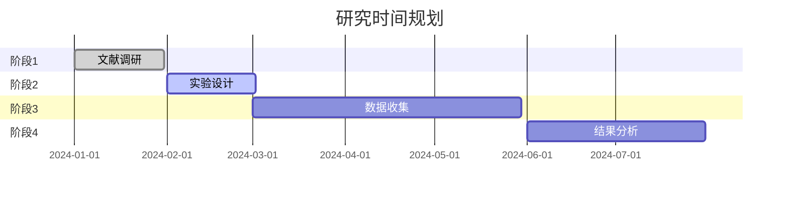

# 最终研究想法报告模板

## 研究标题

**[研究标题]**

---

## 摘要

[200-300字摘要]

本研究旨在探讨 [核心问题]。通过 [方法概述]，本研究将 [预期贡献]。研究发现 [主要发现]，对 [领域] 的 [意义]。

---

## 研究背景

### 领域现状

[领域当前状态] [1-3]

### 研究缺口

[指出现有研究的不足]

### 研究切入点

[本研究如何填补缺口]

---

## 研究目标

本研究旨在实现以下目标：

1. **目标1**: [具体描述] [4]
2. **目标2**: [具体描述] [5]
3. **目标3**: [具体描述]

### 核心假设

[H假设标题]: [假设陈述]

---

## 研究方法

### 方法概述

[总体方法描述]

### 技术路线

| 步骤 | 方法 | 预期输出 |
|------|------|---------|
| 1 | [方法1] | [输出1] |
| 2 | [方法2] | [输出2] |
| 3 | [方法3] | [输出3] |

### 可行性分析

- **技术可行性**: [分析]
- **资源需求**: [分析]
- **潜在风险**: [分析]

---

## 预期结果

### 主要发现

1. **发现1**: [描述] [6]
2. **发现2**: [描述] [7]
3. **发现3**: [描述]

### 结果解释

[对结果的解释和意义]

---

## 创新点

### 理论创新

[理论层面的创新]

### 方法创新

[方法层面的创新]

### 应用价值

[实际应用价值]

---

## 研究意义

### 理论意义

- [意义1] [8]
- [意义2]

### 应用价值

- [应用1]
- [应用2]

---

## 假设与研究设计映射

| 假设 | 研究设计组件 | 验证方法 | 相关问题 |
|------|------------|---------|---------|
| H1 | [组件1] | [方法] | S4-P1, S5-P1, S6-P1 |
| H2 | [组件2] | [方法] | S4-P2, S5-P2 |
| H3 | [组件3] | [方法] | - |

---

## 时间规划

---

## 局限性

[说明研究的局限性和边界条件]

---

## 参考文献

[1] [作者]. [论文标题]. [期刊]. [年份];[卷]:[页码]. doi:[DOI].

[2] [作者]. [论文标题]. [期刊]. [年份];[卷]:[页码]. doi:[DOI].

...

---

## 附录

### 补充数据

[补充材料]

### 代码和数据

[代码和数据可用性说明]

---

*本报告由 Scispark 工作流生成*
